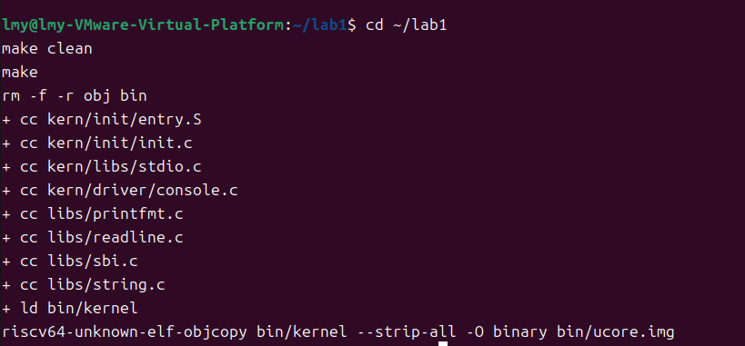
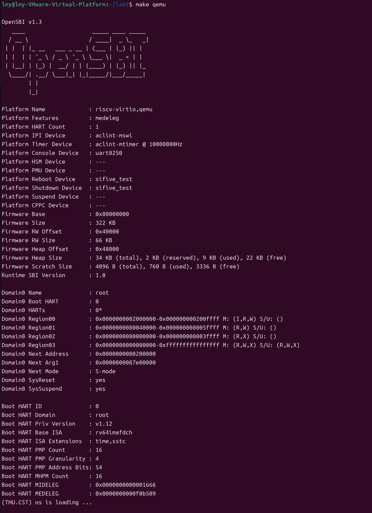
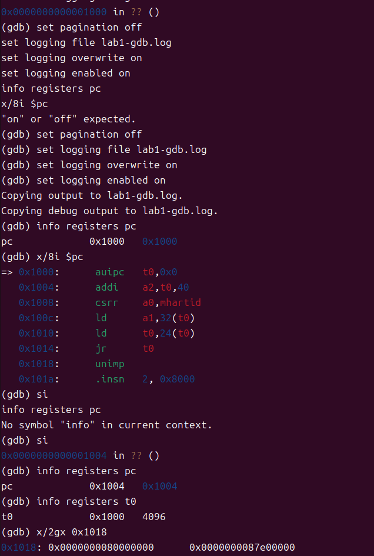
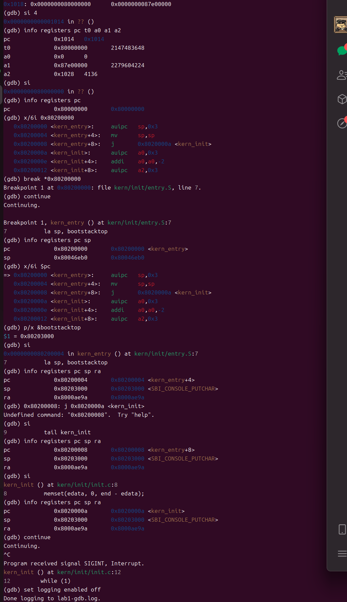

# 操作系统实验报告

## 实验基本信息

| 项目 | 内容 |
| --- | --- |
| **实验名称** | Lab 1：比麻雀更小的麻雀（最小可执行内核） |
| **小组成员** | 2413982-李珉熠（组长）、2411080-吴宇石、2413715-赵亚鑫 |
| **完成日期** | 2026-10-08（材料整理日期） |

### 小组分工

小组按环境与构建、入口代码分析、启动流程调试三个模块分工。各成员负责对应模块的分析与报告内容，组长负责最终汇总。

| 成员 | 负责的练习/模块 | 报告与核对职责 |
| --- | --- | --- |
| 2413982-李珉熠（组长） | 实验环境与构建配置；QEMU 启动参数修复；整体启动验证 | 汇总报告，核对启动结果、源码修改和提交材料 |
| 2411080-吴宇石 | 练习一：入口汇编、内核栈、tail 跳转及 C 入口分析 | 负责入口代码原理部分，核对栈大小、地址与调用关系 |
| 2413715-赵亚鑫 | 练习二：GDB 单步、入口断点、寄存器和日志分析 | 负责调试流程与证据部分，核对截图、日志及实验结论 |

**报告分工：** 李珉熠负责实验环境、构建配置、启动参数修复及报告汇总；吴宇石负责练习一的入口汇编、内核栈与 C 入口原理；赵亚鑫负责练习二的 GDB 流程、寄存器记录及截图与日志说明。三人共同核对源码、运行结果与报告结论的一致性。

---

## 一、实验目的

1. 理解 RISC-V 最小内核的编译、链接、镜像加载与启动过程。
2. 理解内核入口设置栈指针、跳转到 C 函数以及使用 SBI 输出字符的机制。
3. 使用 QEMU 和 GDB 验证从复位到内核入口的执行过程，以实际寄存器和内存记录支持分析。
4. 通过 AI 协助阅读代码、定位启动参数问题和解释调试结果，并核对 AI 分析是否得到实验验证。

---

## 二、实验环境

| 项目 | 实验环境 |
| --- | --- |
| 宿主与开发环境 | Windows，VMware 中的 Ubuntu |
| 目标平台 | QEMU virt，64 位 RISC-V |
| 固件 | OpenSBI v1.3（启动输出确认） |
| 构建工具 | GNU make、riscv64-unknown-elf 工具链 |
| 调试工具 | GDB，通过 localhost:1234 连接 QEMU |
| 实验目录 | /home/lmy/lab1 |
| 实测证据 | lab1-gdb.log，以及实际终端启动输出 |

### AI 工具使用情况

小组三名成员均使用 Codex 桌面应用辅助各自负责的模块，具体分工如下。

| 成员 | AI 编程工具 | 底层模型版本 | 对应模块与 AI 辅助内容 |
| --- | --- | --- | --- |
| 2413982-李珉熠（组长） | Codex 桌面应用 | 未单独记录具体版本 | 实验环境与构建配置：辅助阅读 Makefile、分析 QEMU 加载方式与 OpenSBI 交接入口，整理启动参数修复和整体运行验证 |
| 2411080-吴宇石 | Codex 桌面应用 | 未单独记录具体版本 | 练习一：辅助分析 la、tail、bootstacktop、栈大小与增长方向，结合源码和反汇编解释汇编入口到 C 函数的执行过程 |
| 2413715-赵亚鑫 | Codex 桌面应用 | 未单独记录具体版本 | 练习二：辅助梳理 GDB 单步、断点和寄存器观察方法，分析复位代码到 OpenSBI 再到内核入口的过程，整理调试日志与截图说明 |

**使用与验证方式：** Codex 用于辅助阅读、分析和报告整理；实验结果以源码、实际终端输出、寄存器和原始调试日志为依据。入口指令解释通过反汇编及 sp、pc、ra 的变化核对，启动参数修复通过 Next Address 与内核输出核对，调试流程通过日志和截图核对。具体模型版本未单独记录，因此不填写推测版本。

---

## 三、实验整体逻辑分析

### 3.1 本章节的逻辑主线

核心问题是在尚无完整操作系统服务的环境中，让一个最小内核获得 CPU 控制权、建立基本 C 执行条件并输出可观察的启动信息。

### 3.2 功能的逐步实现

实验先通过链接脚本确定内核布局，再交叉编译、链接得到 `bin/kernel`，使用 objcopy 提取出原始二进制镜像 `bin/ucore.img`。QEMU 在 CPU 执行前加载固件和内核镜像。CPU 从复位 ROM 转到 OpenSBI，之后进入内核汇编入口，设置栈指针并跳转到 C 函数。C 入口清零 BSS 区域，通过 SBI 输出启动文字，最后进入无限循环。

执行路线为：

```text
0x1000：QEMU 复位 ROM
    → 0x80000000：OpenSBI
    → 0x80200000：kern_entry
    → 设置内核栈指针
    → kern_init：清零 BSS、输出字符串、无限循环
```

### 3.3 构建与链接

`Makefile` 与 `tools/function.mk` 组织编译、链接、镜像生成和模拟器运行。`tools/kernel.ld` 使用 `ENTRY(kern_entry)` 指定 ELF 入口，并将起始地址设置为 `0x80200000`，依次布置 `.text`、`.rodata`、`.data`、`.sdata` 和 `.bss` 等区域。

其中 `.text` 保存代码，`.rodata` 保存只读数据，`.data` 等保存有初始值的可写数据，`.bss` 为需要零初始化的对象预留空间。`ALIGN(0x1000)` 按 4096 字节对齐，不是按 2 的 4096 次方对齐。ELF 保留入口、布局及调试信息；本实验 objcopy 生成的原始二进制镜像不含 ELF 头，加载地址由启动配置约定。

### 3.4 内核初始化

`kern/init/entry.S` 为 C 代码准备栈。`kern/init/init.c` 中的 `kern_init` 使用链接脚本提供的 `edata` 和 `end` 清零相应区域，再调用 `cprintf` 输出启动文字。最后的 `while (1)` 保证执行流不返回；当前内核没有交互式命令行。

### 3.5 输出模块

输出调用链为：

```text
cprintf → vcprintf → vprintfmt
    → cputch → cons_putc → sbi_console_putchar → sbi_call → ecall
```

`kern/libs/stdio.c` 处理可变参数并提供输出接口，`libs/printfmt.c` 解析格式并通过回调输出字符，`kern/driver/console.c` 封装单字符输出，`libs/sbi.c` 发起 SBI 调用。在本实验使用的传统 SBI 字符输出接口中，服务编号为 1，通过 a7 传递，字符通过 a0 传递。内核执行 ecall 后由机器模式的 OpenSBI 处理，再返回内核。这里使用的是项目自己的 stdio 实现，不依赖宿主 Ubuntu 的 glibc。
---

## 四、实验内容与实现

本实验以已有最小内核为基础，主要进行阅读与调试。实际代码变更仅涉及 Makefile 的启动参数；没有重新编写内核函数。

### 练习一：理解内核启动中的程序入口操作

**负责人：** 2411080-吴宇石，负责本练习的原理分析与证据核对。

**涉及的入口与函数：** 汇编符号 `kern_entry`；C 函数 `int kern_init(void)`，其声明带有 `noreturn` 属性。本练习解释并验证现有代码，不修改上述函数。

入口代码为：

```asm
kern_entry:
    la sp, bootstacktop
    tail kern_init
```

#### la sp, bootstacktop

该伪指令把 `bootstacktop` 的地址装入栈指针 sp，使内核使用自己的栈。它不读取该地址保存的数据，也不在执行时动态分配栈空间。栈空间由 `.space KSTACKSIZE` 预留，KSTACKSIZE 为 2 × 4096 = 8192 字节，bootstacktop 标记其高地址边界。栈向低地址增长，为 C 函数保存寄存器、建立栈帧等操作提供空间。

本次反汇编显示该伪指令对应：

```asm
0x80200000: auipc sp,0x3
0x80200004: mv    sp,sp
```

第一条将 sp 设置为当前指令地址加上高位偏移：`0x80200000 + (0x3 << 12) = 0x80203000`。本次低位偏移为零，第二条不改变 sp。GDB 查询 `p/x &bootstacktop` 得到 `0x80203000`，与实际结果一致。

进入 kern_entry 时，sp 仍为固件阶段留下的 `0x80046eb0`。单步执行第一条指令后，sp 变为 `0x80203000`，证明栈切换完成。GDB 将该地址显示为 `<SBI_CONSOLE_PUTCHAR>`，仅表示该地址还匹配另一个符号，不影响栈顶地址的含义。

#### tail kern_init

该伪指令以尾调用方式跳转到 C 入口，不为本次跳转设置新的返回地址。本次链接后的指令为：

```asm
0x80200008: j 0x8020000a <kern_init>
```

执行前后 ra 均为 `0x8000ae9a`，PC 则变为 `0x8020000a`。这说明控制流已经进入 kern_init，而不是通过普通调用建立返回 kern_entry 的地址。kern_init 标记为 noreturn，并在最后无限循环，因此不需要返回到入口汇编。

| 观察位置 | PC | SP | RA |
| --- | --- | --- | --- |
| auipc 执行后 | 0x80200004 | 0x80203000 | 0x8000ae9a |
| mv 执行后 | 0x80200008 | 0x80203000 | 0x8000ae9a |
| 跳转执行后 | 0x8020000a | 0x80203000 | 0x8000ae9a |

### 练习二：使用 GDB 验证启动流程

**负责人：** 2413715-赵亚鑫，负责本练习的调试流程与日志核对。

#### 调试方法

在两个 Ubuntu 终端进入实验目录，分别执行 `make debug` 和 `make gdb`。前者使用 QEMU 的 `-S` 暂停 CPU、`-s` 提供 GDB 连接端口；后者加载 `bin/kernel` 的调试符号并连接 `localhost:1234`。

在 GDB 中逐条执行以下命令，开启日志并检查最初的指令：

```gdb
set pagination off
set logging file lab1-gdb.log
set logging overwrite on
set logging enabled on
info registers pc
x/8i $pc
```

#### 复位地址及最初指令的功能

实测 PC 为 `0x1000`，此处为当前 QEMU virt 配置的复位 ROM，不是内核入口，也不是位于 `0x80000000` 的 OpenSBI 主体。最初指令如下：

| 地址 | 指令 | 功能 |
| --- | --- | --- |
| 0x1000 | auipc t0,0x0 | 将当前地址 0x1000 放入 t0 |
| 0x1004 | addi a2,t0,40 | 将启动信息地址 0x1028 放入 a2 |
| 0x1008 | csrr a0,mhartid | 将硬件线程编号放入 a0 |
| 0x100c | ld a1,32(t0) | 从 0x1020 取出设备树地址 |
| 0x1010 | ld t0,24(t0) | 从 0x1018 取出下一阶段入口 |
| 0x1014 | jr t0 | 跳转到该入口 |

`x/8i` 还把 0x1018 后的数据尝试解释为指令，显示 unimp 等内容；这些不是本条执行路径接着执行的指令。

执行第一条指令后，`info registers t0` 得到 `0x1000`。使用 `x/2gx 0x1018` 观察到：

```text
0x1018: 0x0000000080000000  0x0000000087e00000
```

从 0x1004 执行 `si 4` 后，PC 为 0x1014，t0 为 0x80000000，a0 为 0，a1 为 0x87e00000，a2 为 0x1028。再执行一次 si，PC 变为 0x80000000，证明复位代码已将控制权交给 OpenSBI。

#### 从 OpenSBI 到内核入口

在 PC 为 0x80000000 时执行 `x/6i 0x80200000`，已能读取 kern_entry 的指令，说明此时内核镜像已经位于内存中。结合当前 QEMU 的加载方式，不应假设必须通过监视点才能看到 OpenSBI 执行过程中写入内核。

设置断点并继续：

```gdb
break *0x80200000
continue
info registers pc sp
x/6i $pc
p/x &bootstacktop
```

断点命中 kern_entry，PC 为 0x80200000，sp 为 0x80046eb0，bootstacktop 为 0x80203000。随后按练习一逐条执行，确认栈指针改变并进入 kern_init。

本次对短小的复位代码逐条跟踪，对 OpenSBI 内部初始化采用继续执行到内核断点的方法；没有逐条分析全部固件代码。实验验证了三个阶段的关键地址与交接，而非 OpenSBI 每个内部函数。

#### 内核运行结果

普通启动终端输出包含：

```text
Domain0 Next Address : 0x0000000080200000
Domain0 Next Mode    : S-mode
(THU.CST) os is loading ...
```

调试最后继续执行，再按 Ctrl+C 暂停，原始日志显示 PC 所在源码行为 `while (1)`。这与代码的预期终态一致。GDB 的 SIGINT 是人工暂停调试产生的信号，不表示内核自行崩溃。

停止日志后执行 detach 和 quit，退出 GDB；QEMU 使用 Ctrl+A、松开后按 X 退出。

### 功能模块：QEMU 启动参数兼容性修复

**负责人：** 2413982-李珉熠，负责启动参数修复记录与整体运行结果核对。

#### 模块功能描述

**需要修改的位置：** Makefile 中的 qemu 和 debug 目标，无 C 函数修改。目的在于让当前 QEMU/OpenSBI 配置正确衔接到已有内核入口。

#### 最终提示词与实际协作记录

实际协作采用连续对话，而不是一次提交完整结构化提示词。用户先粘贴只出现 OpenSBI、Next Address 为 0 的运行输出，并说明“这是make qemu之后的输出”；修复后继续询问：

> 你对于原始代码做了什么，让原来无法启动的os成功启动？原理是什么？

以下为依据实际问题整理的可复用提示词，用于说明任务边界，**并非当时逐字使用的历史提示词**：

```text
[目标]
分析 Lab1 执行 make qemu 后只有 OpenSBI 输出、未进入内核的原因。
[已有信息]
OpenSBI v1.3 的 Next Address 为 0；链接地址为 0x80200000；
Makefile 使用 -device loader 加载 bin/ucore.img。
[约束]
先检查镜像加载方式与固件交接入口，保留原 Makefile，避免无依据修改内核。
[验收]
实际启动后 Next Address 为 0x80200000，并打印内核启动文字；
解释修改原理，区分实测结果与推测。
```

#### 实现迭代过程

可核实的修改过程包含一次参数修正，随后使用修正后的直接启动命令、make qemu 和用户终端运行结果验证；这些验证不是多次代码生成迭代。

**初始问题、原因和修改：**

原始 Makefile 的 qemu 和 debug 目标使用：

```makefile
-device loader,file=$(UCOREIMG),addr=0x80200000
```

该方式将镜像放入指定内存位置，但在本次默认固件配置下，没有正确提供 OpenSBI 的下一阶段入口。输出中的 `Domain0 Next Address` 为 0，没有出现内核启动文字。

将两处参数替换为：

```makefile
-kernel $(UCOREIMG)
```

修改后，QEMU 的 RISC-V 启动流程为默认 OpenSBI 提供正确的内核入口，Next Address 变为 0x80200000，内核成功打印文字。原文件在实验工作目录中备份为 `Makefile.before-kernel-fix`；提交包使用 `changes/Makefile.patch` 保存本次改动记录。本次仅修改了启动和调试参数，没有修改内核 C 或汇编源码。

这一问题说明，将程序装入内存与把执行控制权交给程序是两个不同环节。课程旧示例使用 OpenSBI v0.6，本次为 v1.3，但不能仅凭版本号断言旧固件的具体实现，也不能将本次现象推广成所有 loader 方式都不可用。

**最终结果：** 当前启动参数修复得到实际运行验证，内核进入预期循环；未声称自动评分通过。

#### 调试交互中遇到的问题

一次粘贴多条命令时，GDB 将它们当成单条命令解析，出现 `"on" or "off" expected`、`No symbol "info" in current context`。逐条输入后正常执行。将反汇编输出误当命令输入，也会出现 Undefined command；该错误没有改变随后观察的执行状态。

#### 符号与运行状态的误判

复位 ROM 和 OpenSBI 地址显示 `?? ()`，是当前加载的内核符号不覆盖这些位置，不代表 CPU 执行错误。启动文字之后没有交互，是内核只有输出和无限循环，尚未实现 shell。

当前实验包虽然在 Makefile 中保留 grade 目标，但不包含 `tools/grade.sh`。本报告不声称通过 make grade，以实际启动和 GDB 证据验证要求的行为。

### Challenge

已阅读的 Lab1 练习页面未列出独立 Challenge，本报告不虚构额外完成项。

---

## 五、测试与验证

| 验证项 | 结果与证据 |
| --- | --- |
| 原始内核可执行产物 | 编译截图显示 make clean 后重新执行 make，完成源码编译、bin/kernel 链接与 bin/ucore.img 生成，无错误输出；启动另有图证 |
| 修正后的 make qemu | Next Address 为 0x80200000，输出 (THU.CST) os is loading ... |
| 复位到 OpenSBI | GDB 单步观察 PC 从 0x1014 跳到 0x80000000 |
| OpenSBI 到内核入口 | 断点命中 0x80200000 的 kern_entry |
| 内核栈初始化 | sp 从 0x80046eb0 变为 0x80203000 |
| tail 跳转 | PC 变为 0x8020000a，ra 保持 0x8000ae9a |
| 最终运行状态 | 继续执行后人工暂停，日志停在 kern_init 的 while (1) |
| make grade | 当前包缺少 tools/grade.sh，不声称评分通过 |

### 原始证据及截图

#### 0. 清理后重新编译内核



图0为补充的编译终端截图：在 `~/lab1` 执行 `make clean` 和 `make`，清理 `obj`、`bin` 后重新编译 `kern/` 与 `libs/` 的源文件，再链接 `bin/kernel`，最后通过 `riscv64-unknown-elf-objcopy` 生成 `bin/ucore.img`。截图中的命令输出没有编译或链接错误。此图用于证明构建流程，运行结果由图1及 GDB 日志另行支持。

#### 1. 内核启动结果

在实验目录执行 `make qemu` 后，OpenSBI 输出的下一阶段入口为 `0x80200000`，运行模式为 S-mode，随后出现 `(THU.CST) os is loading ...`。该结果证明执行流已进入内核并完成启动文字输出。



图1为实际启动终端截图；编译过程见图0。输出后没有交互提示符，与内核最后的无限循环一致。

#### 2. GDB 启动与入口调试



图2(a)显示初始 PC 为 `0x1000`，该地址处的复位指令完成启动参数准备和下一阶段入口读取。执行第一条指令后，PC 为 `0x1004`，t0 为 `0x1000`；读取 `0x1018` 处的两个八字节数，得到 OpenSBI 入口 `0x80000000` 和设备树地址 `0x87e00000`。图中多行粘贴引起的命令解析错误随后已通过逐条输入纠正。



图2(b)从跳转前的寄存器状态开始，记录了以下实测结果：

- 在 PC 为 `0x1014` 时，t0 为 `0x80000000`；执行一次 si 后，PC 到达 OpenSBI 入口 `0x80000000`。
- 设置并命中 `0x80200000` 处的内核入口断点，此时 sp 为 `0x80046eb0`。
- 查询 bootstacktop 得到 `0x80203000`，单步执行后 sp 切换到该地址。
- 执行 tail 对应的跳转后，PC 为 `0x8020000a`，进入 kern_init，ra 保持 `0x8000ae9a`。
- 继续运行后按 Ctrl+C，程序暂停在 kern_init 的 `while (1)` 处。

图中的 Undefined command 来自误将反汇编文本作为命令输入，后续单步操作正常；SIGINT 来自人工暂停，不代表内核崩溃。原图保留这些信息，以便核对真实操作过程。

#### 3. 原始日志与验证范围

完整调试输出保存在与报告同目录的 [lab1-gdb.log](./lab1-gdb.log)，未清除操作错误。图2(a)与图2(b)按执行顺序展示从复位代码到内核初始化的关键观察，完整反汇编、单步输出及人工中断记录可在原始日志中核对。

目前已附清理后重新编译、QEMU 启动和 GDB 调试截图，覆盖构建、启动与入口调试的关键过程。当前包缺少 `tools/grade.sh`，因此不提供或声称存在 make grade 通过结果。

---

## 六、实验总结与收获

### 对操作系统的理解

| 知识点 | 实验中的体现 | 联系与边界 |
| --- | --- | --- |
| 启动与控制权交接 | ROM → OpenSBI → kern_entry | 体现分阶段引导；具体地址属于当前平台配置，不是所有计算机的固定地址 |
| 特权级与固件接口 | 内核运行于 S 模式，通过 SBI 请求 M 模式服务 | 与受控陷入有关，但不是用户进程向内核发起的系统调用 |
| 程序布局与装载 | 链接脚本、ELF、原始镜像和加载地址 | 区分链接时布局、文件内容及运行时地址；尚未建立进程虚拟地址空间 |
| 栈与函数调用 | 设置 sp、tail 跳转、ra 保持不变 | 理解 C 执行需要的运行环境；尚未进行任务间上下文切换 |
| 静态数据初始化 | memset 清零 BSS 区域 | 内核需要自行建立相关初始状态；这不等于已经实现物理内存分配器 |
| 设备输出与分层 | cprintf 逐层调用到 SBI | 高层格式化与底层字符服务分离；未实现完整设备管理和输入交互 |
| 调试与证据 | 单步、断点、寄存器、内存观察 | 用实际机器状态验证源码理解；并非仅凭启动文字判断所有功能正确 |

OS 原理中重要但本次尚未涉及的内容包括进程与线程管理、调度、页表和地址空间隔离、缺页处理、中断处理框架、同步互斥、文件系统和用户态系统调用。最小内核为这些后续功能提供了启动基础，但本身尚不能作为完整的多任务操作系统使用。

### AI 协作开发的经验

本次协作先由 AI 阅读源码和课程要求，再根据实际运行日志定位问题。最初只有 OpenSBI 输出，不能仅凭固件出现就判定内核启动成功；修正入口传递后，还需检查 Next Address 与内核文字。GDB 阶段同样以寄存器、反汇编和断点为证据，未把教程中的示例地址当作本机结果。

操作中曾将多条命令一次粘贴，或把 AI 展示的反汇编当作命令输入。后续改为逐条执行，并区分解释、命令和预期输出。对 AI 给出的版本兼容性解释，也将已验证的现象与尚未确认的旧固件实现分开。

小组按模块组织 AI 辅助分析与人工核对：李珉熠侧重构建和启动配置，吴宇石侧重入口代码及栈的原理，赵亚鑫侧重调试流程和机器状态。报告分别呈现三个模块的分析内容，并由组长汇总。提示词重述与真实对话分别标明，测试结论限定在已有日志和截图能够支持的范围内，不将一次启动成功扩大为全部功能通过。

### 实验结论

本实验完成了最小内核启动验证，使用 GDB 观察到复位地址 0x1000、OpenSBI 入口 0x80000000 和内核入口 0x80200000，并通过 sp 与 ra 的变化验证了入口汇编的作用。修复启动参数的过程进一步表明，镜像加载地址和固件交接入口需要匹配。最后内核输出预期文字并进入源码规定的无限循环。

### 参考与证据

- [课程练习要求](http://8.135.34.58/lab2026/_book/lab1/lab1_2_1_exercise.html)
- [课程 GDB 调试说明](http://8.135.34.58/lab2026/_book/lab1/lab1_4_gdb.html)
- [课程报告要求](http://8.135.34.58/lab2026/_book/lab1/lab1_5_requirement.html)
- 原始实测日志：同目录 `lab1-gdb.log`。
- 核心源码：`kern/init/entry.S`、`kern/init/init.c`、`tools/kernel.ld`、`kern/libs/stdio.c`、`libs/sbi.c`。
